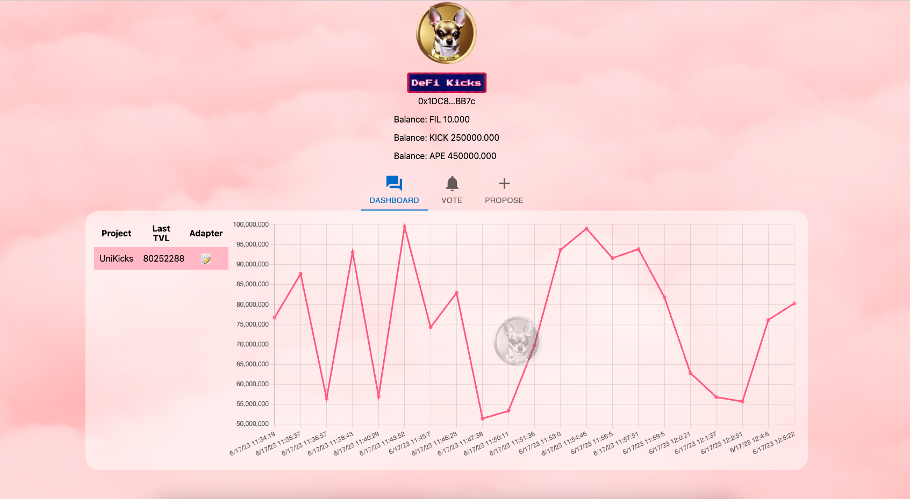
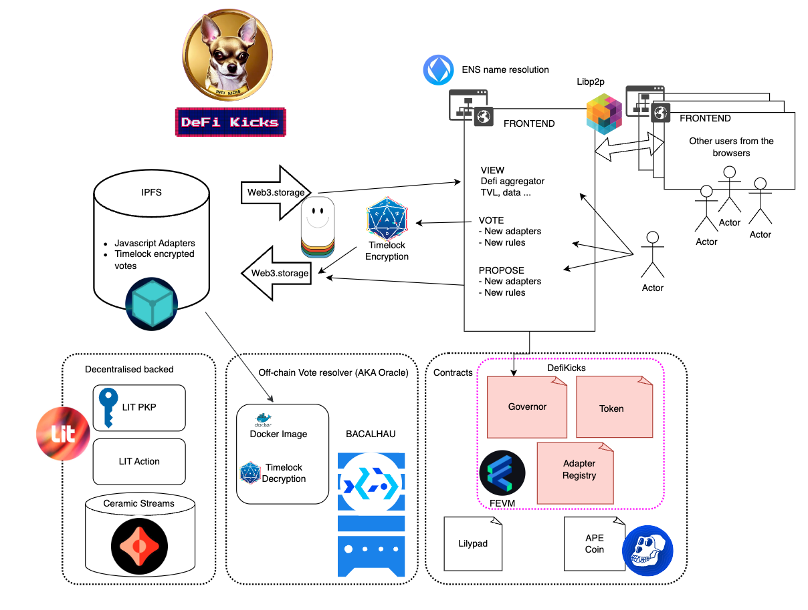

# DefiKicks DAO

**ENS: defikicks.eth**

## Defi kicks dapp
[defikicks.xyz](https://www.defikicks.xyz/)

[defikicks.on.fleek.co](https://defikicks.on.fleek.co/)

Short description:

***DefiKicks is a decentralized, community-governed Data DAO on Filecoin that democratizes DeFi data aggregation and TVL calculations, enhancing transparency and fostering collaboration through on-chain adapter proposals, off-chain voting, and interoperable token rewards.***

# DefiKicks: A Decentralized Approach to DeFi Data
### Overcoming Centralization in DeFi Aggregators
DefiKicks, a pioneering Data DAO on Filecoin network, addresses the latent issue of centralization in TVL (Total Value Locked) and DeFi data aggregators like DefiLlama. The hidden centralized processes in these platforms pose a significant challenge, particularly in their calculation methods. By moving the TVL computation on-chain, DefiKicks fosters an environment of trust and transparency, enhancing the authenticity of the data presented.

### TVL Adapters: A Decentralized Version Control System
In the spirit of decentralization, DefiKicks functions akin to a version control system, similar to 'Git'. This innovative system empowers any individual to propose a new TVL adapter for a project. The democratic ethos ensures the collective intelligence and inclusivity of the DeFi community.

### On-chain Proposals and Off-chain Voting
TVL adapters, written in JavaScript, are proposed on-chain on the Filecoin network (FEVM) via an IPFS hash, with the code hosted on IPFS. Voting for these adapters takes place off-chain to ensure unbiasedness. This voting process utilizes the time-lock encryption of Drand, with the results brought back on-chain through Bacalhau Lilypad, our trusted oracle.

### Approval and Registration of Adapters
Once a TVL adapter gets the community's nod, it's registered on-chain in the 'Registry' contract. The contract references the code's IPFS hash, maintaining a transparent and immutable record of approved adapters.

### Rewards for Correct Voting: KICK Token
Community participants who vote in line with the majority receive rewards in the form of KICK tokens. The emission of these tokens is determined by the governance contract, incentivizing active participation and wise decision-making.

### Interoperability with ApeCoin
Users are not limited to voting with KICK tokens alone. They can also vote with ApeCoin, an ERC-20 governance and utility token designed for decentralized communities at the forefront of culture and web3. This feature fosters collaboration and leverages the wide-reaching community and collective wisdom of APE.

### TVL Calculation Post Adapter Registration
After an adapter is registered, the decentralized backend starts calculating data points using the code hosted on IPFS. This process utilizes a combination of Lit's Programmable Key Pairs and Lit Actions, controlling a Ceramic Stream where all TVL results are hosted. These results are available for users to view on the frontend, fostering an open and transparent DeFi ecosystem.

In essence, DefiKicks offers a more decentralized, transparent, and comprehensive data solution for the DeFi space. By leveraging the power of the community, it aims to bring a new era of trust and accessibility to DeFi analytics.

Github repo:
https://github.com/md0x/defikicks

# Technologies Powering DefiKicks
##  Smart contracts
### 1. GovernorContract

This primary contract regulates governance token emissions and the Adapter Registry. It allows users to propose governance actions, such as adding new adapters to the Adapter Registry. Although voting takes place off-chain (similar to Snapshot), results are brought on-chain using Lilypad and Bacalhau. Users who vote in line with the majority receive inflationary rewards calculated off-chain during the same Bacalhau job. Importantly, the off-chain votes remain unbiased due to Drand's Timelock encryption.
### 2. DefiKicksDataGovernanceToken

This utility token is used for off-chain voting. Inflationary rewards are given to those who cast correct votes.

### 3 DefiKicksAdapterRegistry

This contract holds IPFS references to the adapter's JavaScript code. DefiKicks permits anyone to propose a code snippet to calculate any project's TVL. Once approved, this contract retains essential information for the Lit+Ceramic workflow to generate data off-chain.

##  LIT PROTOCOL

DefiKicks employs Lit Protocol's Programmable Key Pairs (PKPs) to:

Control Ceramic streams in a decentralized manner where DeFi data is stored.
Sign the calculated data, ensuring it was generated following DefiKicks' rules and voted adapters.
Run adapter code securely and decentralized through Lit actions.
The Lit protocol is vital for ensuring distributed data governance calculation in DefiKicks.

##  CERAMIC

Ceramic is a decentralized data network that powers an ecosystem of interoperable Web3 applications and services. It’s a decentralised data infrastructure that enables developers to easily store application data, interact with it and build better user experiences without sacrificing the users’ ownership of their own data.

Defi Kicks uses ceramic streams controlled by LIT PKP's to store the core data of the protocol. That is the Defi Data (Only TVL's currently).

##  LIBP2P

Libp2p is a modular network stack that allows DefiKicks to choose its transports and security protocols. This flexibility aids in establishing secure peer-to-peer network connections, optimizing the performance of DefiKicks' data processing and distribution.

Defi kicks uses libp2p to allow users browsers to communicate between them to notify when a new vote is casted in a decentralized way.

##  APE Coin

ApeCoin is used in DefiKicks as an alternate voting token, extending the platform's reach and encouraging collaboration within the expansive APE community. It strengthens DefiKicks' vision of promoting decentralized governance by empowering a wider community to participate in the decision-making process.
##  Bacalhau

Bacalhau plays a pivotal role in DefiKicks by executing off-chain jobs, such as the computation of inflationary rewards and the tallying of off-chain votes, ensuring a smooth and efficient voting and rewards process.

This jobs are requested on-chain through [Bacalhau Lilypad](https://github.com/bacalhau-project/lilypad) and then executed off-chain by Bacalhau. The results are then brought back on-chain through Lilypad in a decentralized way.

##  Filecoin FEVM

As the blockchain that powers all contract interactions, Filecoin FEVM serves as the backbone of DefiKicks' Data DAO. It enables the platform to govern data and interact with Lilypad and Bacalhau, thereby ensuring the integrity and reliability of the system.

##  IPFS Inter planetry File System

The IPFS serves a critical role in DefiKicks by facilitating decentralized data storage. Key uses include hosting the JavaScript adapter's distributed code and the encrypted votes, ensuring transparency and security.

##  WEB3.Storage

Web3.Storage is used to upload and retrieve data to and from IPFS. It handles various data types including the adapter's code and the timelock encrypted votes, ensuring seamless and reliable data transfer.

##  Drand - Timelock encryption

Drand revolutionizes the voting process in DefiKicks by providing unbiased, off-chain voting through timelock encryption during the voting phase. By hiding the votes during this phase, users are incentivized to vote with their independent judgment, thus improving the quality of vote resolutions. This mechanism significantly enhances the user experience compared to a traditional commit & reveal scheme.

